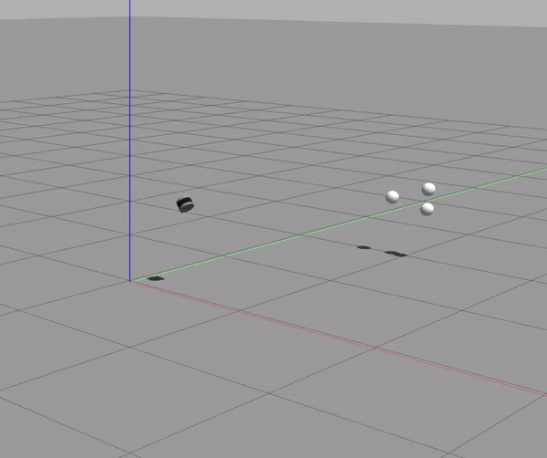

# TLS Laser Sim

This ROS stack contains the following packages:
* `sim_description`: Brings up a simulation of the the Velodyne VLP-16 Lidar. Requires the Velodyine ROS package as a dependency which is also provided here. This package contains a custom plugin to allow `cmd_vel` to apply velocity commands in all 6 DOFs as once if needed (without gravity). This was created before neither the drone plugins or the any of the pre-existing plugins allowed for a very simple non-dynamic 6DOF motion. 

* `keyboard_teleop`: This package is a modified version of the old turtlebot2 `keyboard_teleop` package which now allows for keyboard presses that allow manipulation of the lidar in all six DOFs.

* `process_lidar`: This is the most important package. This contains the main code. 

simulation of a VLP-16 Lidar on a floating 6DOF frame observing measurements of 3 distinct objects. 



**Dependencies:**

- [velodyne_simulator package](https://github.com/ToyotaResearchInstitute/velodyne_simulator.git) 
- Gazebo
- PCL

**Note**: Tested on ROS Melodic and ROS Noetic

**Installation:**

1. Install ROS. Follow the instructions here for ROS Kinetic on Ubuntu 16: http://wiki.ros.org/kinetic/Installation/Ubuntu. For newer versions of ubuntu, please select the appropriate ROS version. 

2. Check if you have PCL with:

   ```bash
   $ ldconfig -p | grep libpcl
   ```

   Otherwise install from https://pointclouds.org/downloads/

   If you have ROS Kinetic and above installed on your system, then you will have the required PCL libraries by default. 

3. Create a new folder in your home environment called `ros_ws`. Create a folder within in called `src`. 

   ```bash
   $ mkdir ros_ws & cd ros_ws
   ros_ws$ mkdir src & cd src
   ```

4. Clone the `velodyne_simulator` [package](https://github.com/ToyotaResearchInstitute/velodyne_simulator.git)  in the `src` folder. Clone the dev branch corresponding to your ROS version. For Kinetic, the "master" branch will need to be cloned.

   ```bash
   $ git clone https://github.com/ToyotaResearchInstitute/velodyne_simulator.git --branch master --single-branch
   ```

 5. Clone this package into the `src` folder. 

    ```bash
    $ git clone https://github.com/adhitir/tls_laser_sim 
    ```

	5. Return to the `ros_ws` folder and build and source it.

    ```bash
    ros_ws$ catkin_make
    ros_ws$ source devel/setup.bash
    ```

    Add the sourcing to the ~/.bashrc file.

    ```bash
    $ echo 'source ~/home/<username>/ros_ws/devel/setup.bash' >> ~/.bashrc 
    ```

**Implementation:**

The Lidar pose is controlled with `geometry_msgs/Twist` by publishing to `/cmd_vel`

Launch simulation:

```bash
$ roslaunch sim_description sim.launch
```

Keyboard Teleop: (Not required)

```bash
$ rosrun teleop_twist_keyboard teleop_twist_keyboard.py
```

Sphere segmentation using RANSAC to find the position and radius of the spheres in the environment. 

```bash
$ rosrun process_lidar process_lidar
```

This data is not synced, as the true position is published at a much higher rate than measured values from RANSAC. To sync:

```bash
$ rosrun process_lidar process_lidar_timesync
```

Finally, move the Lidar in a circle to change it's position:

```bash
$ rosrun teleop_twist_keyboard move.py
```

Observe the following topics:

```
/synchronized/truepos
/synchronized/measuredpos
```

The first one gives the time synced data of the true positions of the sphere's wrt the Lidar frame and the second topic gives the measured data of the sphere in the lidar frame calculated by RANSAC. 

**To Do:**

- [x] Adding `/odom` functionality to the 6DOF plugin for ground truth of Lidar pose
- [ ] Adding `/odom_cov` or `/imu` functionality to the plugin for realistic noisy measurements of Lidar pose
- [x] Adding rudimentary feature detection to extract sensor measurements that correspond to features (here, spheres)


**Note:**

To remove the 'gzserver' error: `killall -9 gzserver`
